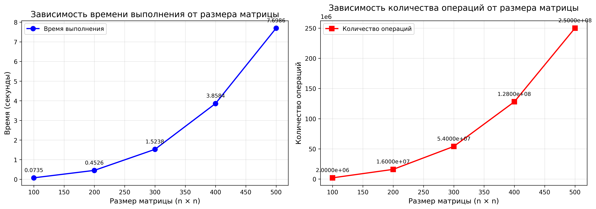

# Отчёт по лабораторной работе №1
---

### 1. Задание

1. Написать программу на языке C/C++ для перемножения двух квадратных матриц.
2. Исходные данные: файл(ы) содержащие значения исходных матриц.
3. Выходные данные: файл со значениями результирующей матрицы, время выполнения, объем задачи.
4. Обязательна автоматизированная верификация результатов вычислений с помощью сторонних библиотек или стороннего ПО (например на Matlab/Python).
5.  Вывести в консоль:
   - размер матриц;
   - время выполнения;
   - количество выполненных арифметических операций.
6. Обеспечить автоматическую проверку корректности с помощью Python.

---
### 2. Структура

| Файл | Описание |
|---------|-----------|
| `matrixA_N.txt` | Первая входная матрица, где N - порядок матрицы |
| `matrixB_N.txt` | Вторая входная матрица, где N - порядок матрицы |
| `result.txt` | Результирующая матрица |
| `data.txt` | Значения для построения графиков зависимостей времени и кол-ва операций от размера матрицы |
| `Parallel_lab1.cpp` | Исходный код программы |
| `verify.py` | Скрипт проверки |
| `gen_matrix.py` | Генерация матриц 100, 200, 300, 400, 500 |
| `graphics.py` | Генерация графиков на основе полученных значений из data.txt |

---
### 3. Результаты

**Вывод `Parallel_lab1.cpp`:**

```
Размер: 100x100
Время выполнения: 0.0734683 сек
Объем задачи (операций): 2000000
Результат записан в: result_100.txt
----------------------------------------
Размер: 200x200
Время выполнения: 0.452555 сек
Объем задачи (операций): 16000000
Результат записан в: result_200.txt
----------------------------------------
Размер: 300x300
Время выполнения: 1.52376 сек
Объем задачи (операций): 54000000
Результат записан в: result_300.txt
----------------------------------------
Размер: 400x400
Время выполнения: 3.85837 сек
Объем задачи (операций): 128000000
Результат записан в: result_400.txt
----------------------------------------
Размер: 500x500
Время выполнения: 7.69865 сек
Объем задачи (операций): 250000000
Результат записан в: result_500.txt
----------------------------------------

Результаты сохранены в data.txt
```

**Вывод `verify.py`:**

```
n=100: Результат верен
n=200: Результат верен
n=300: Результат верен
n=400: Результат верен
n=500: Результат верен
----------------------------------------
```
Вывод `graphics.py`:
## Результаты измерений

На графиках представлены зависимости времени выполнения и количества операций от размера матрицы.

* Графики производительности умножения матриц*

### 4. Вывод

В ходе лабораторной работы реализована программа умножения квадратных матриц на C++.

**Проверка корректности:** Скрипт `verify.py` подтвердил совпадение результатов для всех размеров матриц (100–500), что говорит о правильности реализации алгоритма.

**Производительность:** Время выполнения растет пропорционально количеству операций:
- 100×100: 0.073 с (2 млн операций)
- 200×200: 0.453 с (16 млн)
- 300×300: 1.524 с (54 млн)
- 400×400: 3.858 с (128 млн)
- 500×500: 7.699 с (250 млн)

**Заключение:** Алгоритм демонстрирует кубическую сложность O(n³), что соответствует теоретическим ожиданиям. Результаты корректны и могут быть использованы для дальнейших оптимизаций.

