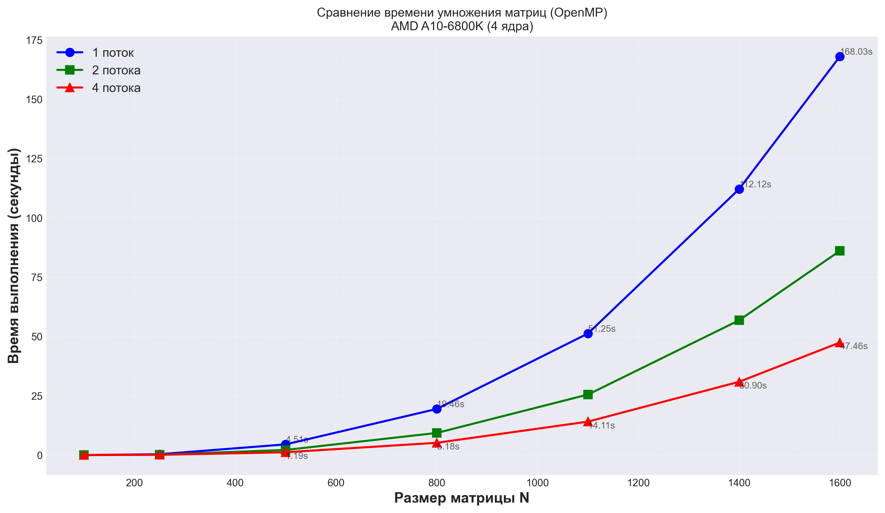

# Лабораторная работа №2
## Параллельное умножение матриц с использованием OpenMP

---

## 1. Цель работы

Модифицировать программу из лабораторной работы №1 для параллельной работы по технологии OpenMP. Провести серию экспериментов с разным количеством потоков (1, 2, 4), разными размерами матриц (100, 250, 500, 800, 1100, 1400, 1600).

---

## 2. Ход работы

В ходе работы код из первой лабораторной работы был адаптирован для работы с OpenMP. Были проведены тесты для различного количества потоков процессора.

**Характеристики оборудования:**
- Процессор: AMD A10-6800K APU
- Тактовая частота: 4.1 GHz (до 4.4 GHz в режиме Turbo)
- Количество ядер: 4

---

## 3. Результаты тестирования

**Размеры матриц:** 100, 250, 500, 800, 1100, 1400, 1600

### Таблица результатов

| Размер матрицы | 1 поток (с) | 2 потока (с) | 4 потока (с) | Ускорение (4x) | Эффективность |
|----------------|-------------|--------------|--------------|----------------|---------------|
| 100 × 100 | 0.0175 | 0.0104 | 0.0066 | 2.66x | 66.5% |
| 250 × 250 | 0.3759 | 0.1949 | 0.1252 | 3.00x | 75.1% |
| 500 × 500 | 4.5149 | 2.1741 | 1.1940 | 3.78x | 94.5% |
| 800 × 800 | 19.4556 | 9.3400 | 5.1829 | 3.75x | 93.8% |
| 1100 × 1100 | 51.2529 | 25.5162 | 14.1074 | 3.63x | 90.8% |
| 1400 × 1400 | 112.1230 | 56.8322 | 30.8989 | 3.63x | 90.7% |
| 1600 × 1600 | 168.0340 | 86.0914 | 47.4589 | 3.54x | 88.5% |

### График зависимости времени от размера матрицы

---

## 4. Анализ производительности

### Ускорение вычислений

| Размер матрицы | Ускорение (2 потока) | Ускорение (4 потока) |
|----------------|---------------------|---------------------|
| 800 × 800 | 2.08x | 3.75x |
| 1100 × 1100 | 2.01x | 3.63x |
| 1400 × 1400 | 1.97x | 3.63x |
| 1600 × 1600 | 1.95x | 3.54x |

### Проверка корректности

Для матрицы размером 1600×1600 проведена верификация результатов умножения с эталонным значением, вычисленным с помощью NumPy. Все результаты признаны корректными (относительная погрешность менее 10⁻⁵).

---

## 5. Выводы

1. **OpenMP работает эффективно** — ускорение на 4 потоках достигает 3.78x (для матрицы 500×500) и стабилизируется на уровне 3.5-3.6x для больших матриц

2. **Хорошая масштабируемость** — для матриц от 500×500 и выше эффективность использования потоков составляет 88-95%

3. **Накладные расходы** заметны на малых размерах — для матрицы 100×100 ускорение всего 2.66x из-за затрат на создание потоков и синхронизацию (эффективность 66.5%)

4. **Зависимость от размера задачи** — чем больше матрица, тем более ощутим выигрыш от параллельных вычислений, так как вычислительная нагрузка растёт как O(n³)

5. **Задача решена успешно** — программа соответствует требованию лабораторной работы, все результаты верифицированы

---

## 6. Итоги

В ходе выполнения лабораторной работы были изучены основы работы с OpenMP. Разработана и протестирована многопоточная программа умножения матриц для различного количества потоков. Полученные результаты подтверждают эффективность параллельных вычислений на больших объемах данных. Наилучшее ускорение составило 3.78x на 4 потоках при эффективности 94.5%. Использование OpenMP позволило сократить время выполнения программы почти в 4 раза для больших матриц по сравнению с последовательной версией.
