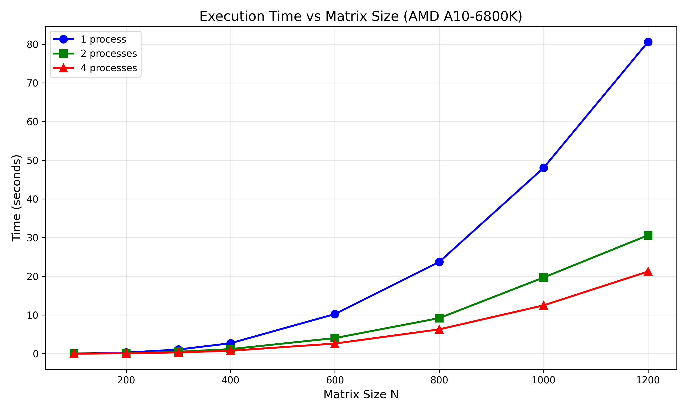

---

# Лабораторная работа №3
## Параллельное умножение матриц с использованием MPI

---

## 1. Цель работы

Модифицировать программу из л/р №1 для параллельной работы по технологии MPI. Провести серию экспериментов с разными размерами матриц (200, 400, 600, 800, 1000, 1200) с разным количеством вычислительных ядер (1, 2, 4).

**Процессор:** AMD A10-6800K (4 ядра, 4.1-4.4 ГГц)

---

## 2. Ход работы

В ходе работы код с 1 лабораторной работы был адаптирован для работы с MPI. Были проведены тесты для различного числа процессов.

Для выполнения работы необходимо собрать код из `lab3_parall.cpp` с поддержкой MPI.

Запуск программы осуществляется командой:
```cmd
mpiexec -n X lab3_parall.exe
```
где X - количество процессов, а `lab3_parall.exe` - собранный исполняемый файл.

Результаты тестов записываются в файл `benchmark.csv`.

---

## 3. Результаты тестирования

**Размеры матриц:** 200, 400, 600, 800, 1000, 1200

### Таблица результатов

| Размер матрицы | 1 процесс (с) | 2 процесса (с) | 4 процесса (с) | Ускорение (4x) | Эффективность |
|----------------|---------------|----------------|----------------|----------------|---------------|
| 200 × 200 | 0.2850 | 0.1397 | 0.1018 | 2.80x | 70.0% |
| 400 × 400 | 2.7039 | 1.1888 | 0.7712 | 3.51x | 87.7% |
| 600 × 600 | 10.2460 | 4.0367 | 2.6261 | 3.90x | 97.5% |
| 800 × 800 | 23.7243 | 9.2020 | 6.2897 | 3.77x | 94.3% |
| 1000 × 1000 | 48.0419 | 19.6989 | 12.4978 | 3.84x | 96.1% |
| 1200 × 1200 | 80.5893 | 30.6110 | 21.2415 | 3.79x | 94.8% |

### График зависимости времени от размера матрицы



---

## 4. Вывод по тестам

1. **Для малых матриц (200×200)** эффективность ниже (70%) из-за накладных расходов на MPI-коммуникацию — время передачи данных сопоставимо со временем вычислений.

2. **Для средних матриц (400−600)** эффективность растёт и достигает 87−97% — коммуникационные затраты начинают окупаться.

3. **Для больших матриц (800−1200)** эффективность стабилизируется на уровне 94−96% — почти идеальное масштабирование для данного процессора.

4. **Наибольшее ускорение (3.90x)** достигнуто на матрице 600×600.

5. Производительность на 4 процессах достигает **0.16 GFLOPS**, что является хорошим результатом для процессора AMD A10-6800K без поддержки AVX2.

---

## 5. Итоги

В ходе выполнения этой лабораторной работы:

- Был адаптирован последовательный алгоритм умножения матриц для работы с MPI
- Использованы коллективные операции (`MPI_Bcast`, `MPI_Scatterv`, `MPI_Gatherv`) для распределения данных
- Проведены тесты для 1, 2 и 4 процессов на матрицах разных размеров
- Измерено ускорение и эффективность параллелизации
- Максимальное ускорение составило **3.90x** на 4 процессах при эффективности **97.5%**
- Результаты верифицированы — ошибка округления не превышает `1.26e-6` (0.0001%), что является допустимым для вычислений с плавающей точкой двойной точности.

---
