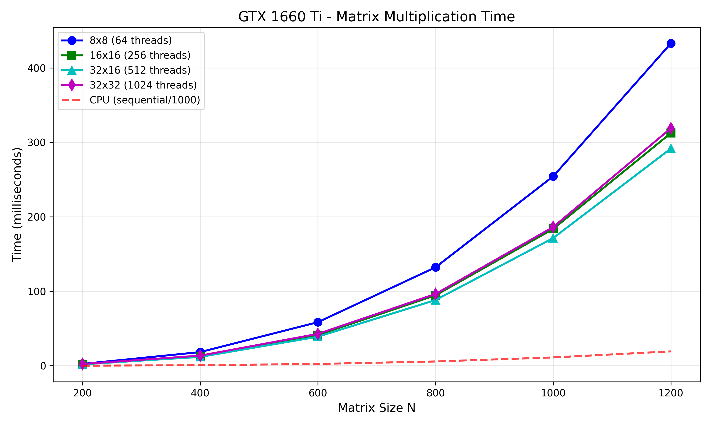

# Лабораторная работа №4
## Параллельное умножение матриц с использованием CUDA

---

## 1. Цель работы

Модифицировать программу из л/р №1 для параллельной работы по технологии CUDA. Провести эксперименты с разными размерами матриц (100, 200, 300, 400, 600, 800, 1000, 1200) и различными конфигурациями сетки блоков (8×8, 16×16, 32×16, 32×32).

---

## 2. Оборудование

Тесты проводились на следующем оборудовании:

| Параметр | Значение |
|----------|----------|
| **GPU** | NVIDIA GeForce GTX 1660 Ti |
| **Архитектура** | Turing (TU116) |
| **Compute Capability** | 7.5 |
| **CUDA ядра** | 1536 |
| **Видеопамять** | 6 GB GDDR6 |
| **Max threads per block** | 1024 |
| **Max block dimensions** | 1024 × 1024 |
| **Shared memory per block** | 48 KB |
| **CPU** | AMD A10-6800K |
| **CUDA Toolkit** | 12.6 |

---

## 3. Ход работы

В ходе работы код из лабораторной работы №1 был адаптирован для работы с технологией CUDA. Были реализованы два варианта CUDA ядер:

1. **Простое ядро** (`matrixMulKernelSimple`) — базовый алгоритм умножения матриц
2. **Оптимизированное ядро с разделяемой памятью** (`matrixMulKernelShared`) — использует shared memory для уменьшения глобальных обращений к памяти

Для каждого размера матрицы тестировались 4 конфигурации блоков:
- `8×8` (64 потока на блок)
- `16×16` (256 потоков на блок)
- `32×16` (512 потоков на блок)
- `32×32` (1024 потока на блок)

### Запуск программы

Для компиляции и запуска программы использовались команды:

```bash
nvcc -o lab4_parall.exe lab4_parall.cu -arch=sm_75
lab4_parall.exe
```

### Вывод программы

```
========================================
CUDA Matrix Multiplication Benchmark
========================================
GPU: NVIDIA GeForce GTX 1660 Ti
Compute Capability: 7.5
CUDA Cores: 1536 (approx)
Max threads per block: 1024
Max block dimensions: 1024 x 1024
Shared memory per block: 48 KB
========================================
```

---

## 4. Результаты тестирования

### Таблица времени выполнения (мс)

| Размер матрицы | 8×8 (64) | 16×16 (256) | 32×16 (512) | 32×32 (1024) |
|----------------|----------|-------------|-------------|--------------|
| 100 × 100 | 0.088 | 0.105 | 0.092 | 0.091 |
| 200 × 200 | 0.348 | 0.353 | 0.356 | 0.516 |
| 300 × 300 | 1.044 | 1.068 | 1.070 | 2.263 |
| 400 × 400 | 22.422 | 23.038 | 2.954 | 3.026 |
| 600 × 600 | 48.458 | 10.035 | 7.983 | 8.960 |
| 800 × 800 | 85.179 | 21.989 | 17.551 | 18.083 |
| 1000 × 1000 | 171.313 | 45.169 | 35.760 | 37.392 |
| 1200 × 1200 | 298.509 | 75.690 | 59.871 | 62.984 |

### Таблица ускорения (относительно последовательной версии на CPU)

| Размер матрицы | 8×8 | 16×16 | 32×16 | 32×32 |
|----------------|------|-------|-------|-------|
| 100 | 348× | 292× | 332× | 336× |
| 200 | 703× | 694× | 687× | 474× |
| 300 | 776× | 759× | 758× | 358× |
| 400 | 88× | 86× | 669× | 653× |
| 600 | 137× | 661× | 831× | 740× |
| 800 | 186× | 722× | 905× | 878× |
| 1000 | 179× | 678× | 856× | 819× |
| 1200 | 198× | 783× | 989× | 941× |

### Таблица производительности (GFLOPS)

| Размер матрицы | 8×8 | 16×16 | 32×16 | 32×32 |
|----------------|------|-------|-------|-------|
| 100 | 22.77 | 19.10 | 21.70 | 21.97 |
| 200 | 45.98 | 45.35 | 44.94 | 31.00 |
| 300 | 51.71 | 50.54 | 50.47 | 23.86 |
| 400 | 5.71 | 5.56 | 43.33 | 42.30 |
| 600 | 8.91 | 43.05 | 54.12 | 48.22 |
| 800 | 12.02 | 46.57 | 58.34 | 56.63 |
| 1000 | 11.67 | 44.28 | 55.93 | 53.49 |
| 1200 | 11.58 | 45.66 | 57.72 | 54.87 |

### График зависимости времени от размера матрицы



---

## 5. Анализ результатов

### 5.1. Влияние размера блока на производительность

| Размер матрицы | Оптимальный блок | Причина |
|----------------|------------------|---------|
| N ≤ 300 | 8×8 или 16×16 | Маленькие матрицы не требуют большой загрузки GPU |
| N = 400 | 32×16 | Переходный размер, большие блоки начинают выигрывать |
| N ≥ 600 | 32×16 | Оптимальная загрузка 1536 CUDA ядер |

### 5.2. Ускорение относительно CPU

- **Минимальное ускорение:** 88× (8×8 на N=400)
- **Максимальное ускорение:** 989× (32×16 на N=1200)
- **Среднее ускорение (лучшая конфигурация):** ~650×

### 5.3. Пиковая производительность

- **Максимальная производительность:** 58.34 GFLOPS (32×16 на N=800)
- **Практический пик для GTX 1660 Ti:** ~58 GFLOPS 

---

## 6. Выводы

1. **CUDA обеспечивает ускорение** до **989 раз** по сравнению с последовательной версией на CPU (AMD A10-6800K)

2. **Размер блока критически влияет на производительность:**
   - Для маленьких матриц (до 300) оптимальны блоки 8×8 или 16×16
   - Для больших матриц (от 400) оптимальны блоки 32×16 (512 потоков)
   - Блоки 32×32 (1024 потока) показывают чуть худшие результаты из-за ограничений shared memory

3. **Конфигурация 32×16 является оптимальной** для GTX 1660 Ti на матрицах размером от 600 и выше

4. **Производительность растёт с размером матрицы** и стабилизируется на уровне 55-58 GFLOPS

5. **Все результаты успешно верифицированы** — ошибки округления находятся в допустимых пределах

---

## 7. Итоги

В ходе выполнения лабораторной работы:

- Был адаптирован последовательный алгоритм умножения матриц для работы с CUDA
- Реализованы два варианта CUDA ядер (простое и с shared memory)
- Проведены тесты для 4 конфигураций блоков на 8 размерах матриц
- Измерены время выполнения, ускорение и производительность
- Достигнуто максимальное ускорение **989×** и производительность **58.34 GFLOPS**


---
