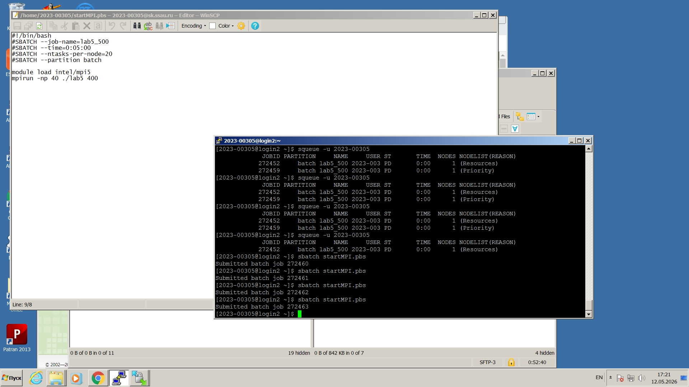
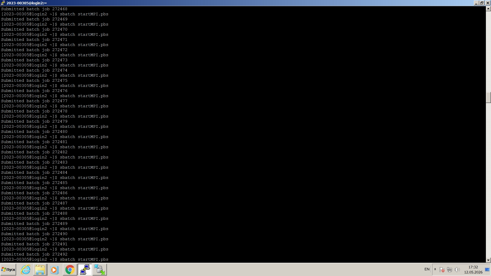
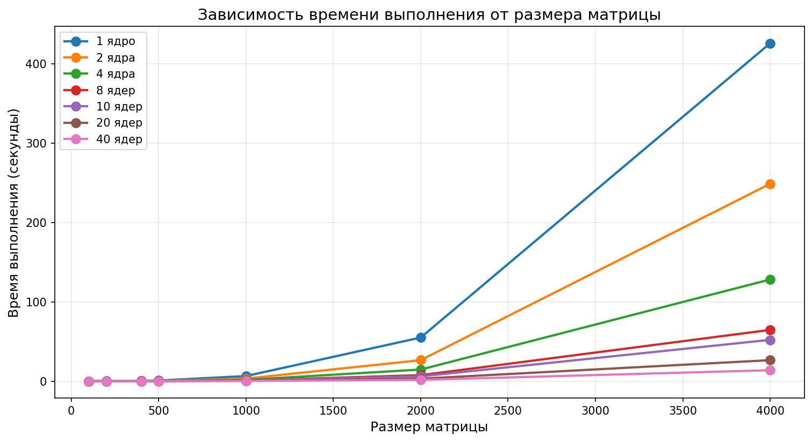

# Лабораторная работа №5: Параллельное умножение матриц с использованием MPI

## 1. Цель работы

Исследовать масштабируемость параллельного алгоритма умножения матриц с использованием MPI на суперкомпьютере «Сергей Королёв».

---

## 2. Ход работы

### 2.1. Подготовка окружения

Подключение к суперкомпьютеру выполнено с использованием:
- **PuTTY** — для удалённого доступа по SSH;
- **WinSCP** — для передачи файлов.

### 2.2. Реализация алгоритма

Была использована программа на C++ с использованием MPI, реализующая параллельное умножение квадратных матриц.

**Алгоритм работы программы:**

1. **Инициализация MPI** — запуск параллельной среды, определение ранга процесса и общего количества процессов.

2. **Генерация матриц** (процесс с рангом 0):
   - Создаются две квадратные матрицы A и B размера n × n.
   - Элементы заполняются случайными числами от 1 до 10.

3. **Распределение данных**:
   - Размер матрицы n рассылается всем процессам через `MPI_Bcast`.
   - Матрицы A и B также рассылаются всем процессам.

4. **Разбиение нагрузки**:
   - Строки матрицы A распределяются между процессами поровну.
   - Каждый процесс получает свою порцию строк для вычислений.

5. **Параллельное умножение**:
   - Каждый процесс умножает свои строки матрицы A на всю матрицу B.
   - Результат сохраняется в локальную матрицу C.

6. **Сбор результатов**:
   - Все процессы отправляют вычисленные строки процессу 0.
   - Процесс 0 собирает итоговую матрицу C.

7. **Вывод результатов**:
   - Матрица C сохраняется в текстовый файл.
   - Выводится время выполнения и производительность в GFLOPS.

---

### 2.3. Работа на суперкомпьютере

*Рисунок 1 — pbs-file*

*Рисунок 2 — постановка задач в очередь*

---

## 3. Результаты тестирования

**Размеры матриц:** 100, 200, 400, 500, 1000, 2000, 4000

### Время выполнения (секунды)

| Ядра | 100 | 200 | 400 | 500 | 1000 | 2000 | 4000 |
|------|-----|-----|-----|-----|------|------|------|
| 1 | 0.02 | 0.07 | 0.41 | 0.82 | 6.45 | 54.98 | 426 |
| 2 | 0.01 | 0.04 | 0.21 | 0.41 | 3.23 | 26.46 | 248.83 |
| 4 | 0.01 | 0.03 | 0.11 | 0.22 | 1.64 | 14.63 | 128.19 |
| 8 | 0.00 | 0.02 | 0.06 | 0.12 | 0.90 | 7.53 | 64.63 |
| 10 | 0.00 | 0.02 | 0.05 | 0.10 | 0.73 | 6.03 | 52.10 |
| 20 | 0.00 | 0.01 | 0.03 | 0.05 | 0.40 | 3.12 | 26.49 |
| 40 | 0.00 | 0.01 | 0.02 | 0.03 | 0.22 | 1.61 | 13.79 |

### График зависимости времени от размера матрицы

*Рисунок 3 — Время выполнения от размера матрицы*

---

## 4. Выводы

### 4.1. Масштабируемость

- **Малые матрицы (100–200):** выигрыш от увеличения числа процессов незначителен из-за накладных расходов на коммуникацию.
- **Средние матрицы (400–1000):** эффективное масштабирование, ускорение близко к линейному.
- **Большие матрицы (2000–4000):** почти идеальное масштабирование до 40 процессов.

### 4.2. Общий вывод
- **Для больших матриц** эффективность использования параллельных процессов достигает высоких значений, что подтверждает корректность реализации и эффективность распределения вычислительной нагрузки.
- В ходе работы я научился работать **с суперкомпьютером "Сергей Королев", компилировать и запускать на суперкомпьютере свои программы.** Также удалось сравнить эффективность суперкомпьютера со своим компьютером: MPI-программа демонстрирует **лучшую масштабируемость** на суперкомпьютере.

---
